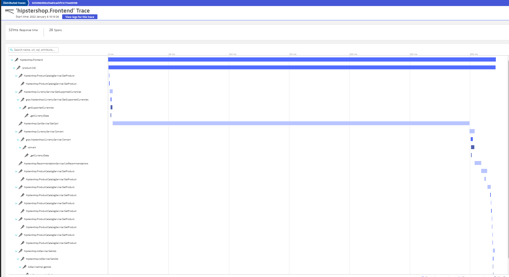

# Is it Observable
<p align="center"></p>

## How to instrument your code with OpenTelemetry
<p align="center"></p>

This tutorial will be based on the popular Demo platform provided by Google : The Online Boutique
<p align="center">

</p>

**Online Boutique** is a cloud-native microservices demo application.
Online Boutique consists of a 10-tier microservices application. The application is a
web-based e-commerce app where users can browse items,
add them to the cart, and purchase them.
The Google HipsterShop is a microservice architecture using several langages :
* Go 
* Python
* Nodejs
* C#
* Java

## Screenshots

| Home Page                                                                                                         | Checkout Screen                                                                                                    |
| ----------------------------------------------------------------------------------------------------------------- | ------------------------------------------------------------------------------------------------------------------ |
| [](./docs/img/online-boutique-frontend-1.png) | [](./docs/img/online-boutique-frontend-2.png) |


## Prerequisite
The following tools need to be install on your machine :
- jq
- kubectl
- git
- gcloud ( if you are using GKE)
- Helm

This tutorial will generate traces and send them to Dynatrace.
Therefore you will need a Dynatrace Tenant to be able to follow all the instructions of this tutorial .
If you don't have any dynatrace tenant , then let's start a [trial on Dynatrace](https://www.dynatrace.com/trial/)

## Deployment Steps

You will first need a Kubernetes cluster with 2 Nodes.
You can either deploy on Minikube or K3s or follow the instructions to create GKE cluster:
### 1.Create a Google Cloud Platform Project
```
PROJECT_ID="<your-project-id>"
gcloud services enable container.googleapis.com --project ${PROJECT_ID}
gcloud services enable monitoring.googleapis.com \
    cloudtrace.googleapis.com \
    clouddebugger.googleapis.com \
    cloudprofiler.googleapis.com \
    --project ${PROJECT_ID}
```
### 2.Create a GKE cluster
```
ZONE=us-central1-b
gcloud container clusters create onlineboutique \
--project=${PROJECT_ID} --zone=${ZONE} \
--machine-type=e2-standard-2 --num-nodes=4
```

### 3.Clone the Github Repository
```
git clone https://github.com/isItObservable/OpenTelemetry-Instrumentation
cd OpenTelemetry-Instrumentation
```
#### 4.Deploy Nginx Ingress Controller
```
kubectl create clusterrolebinding cluster-admin-binding \
  --clusterrole cluster-admin \
  --user $(gcloud config get-value account)
kubectl apply -f nginx/deploy.yaml
```
this command will install the nginx controller on the nodes having the label `observability`

##### 5. get the ip adress of the ingress gateway
Since we are using Ingress controller to route the traffic , we will need to get the public ip adress of our ingress.
With the public ip , we would be able to update the deployment of the ingress for :
* hipstershop
* grafana
* K6
```
IP=$(kubectl get svc nginx-ingress-nginx-controller -n ingress-nginx -ojson | jq -j '.status.loadBalancer.ingress[].ip')
```
#### 4.Prometheus
Our Chaos experiments will utilize the Prometheus as an Observabilty backend
We will neeed to deploy Prometheus only on the nodes having the label `observability`.
```
helm repo add prometheus-community https://prometheus-community.github.io/helm-charts
helm repo update
helm install prometheus prometheus-community/kube-prometheus-stack --set server.nodeSelector.node-type=observability --set prometheusOperator.nodeSelector.selector.node-type=observability  --set prometheus.nodeSelector.selector.node-type=observability --set grafana.nodeSelector.selector.node-type=observability  
```
### 5. Configure Prometheus by enabling the feature remo-writer

To measure the impact of our experiments on use traffic , we will use the load testing tool named K6.
K6 has a Prometheus integration that writes metrics to the Prometheus Server.
This integration requires to enable a feature in Prometheus named: remote-writer

To enable this feature we will need to edit the CRD containing all the settings of promethes: prometehus

To get the Prometheus object named use by prometheus we need to run the following command:
```
kubectl get Prometheus
```
here is the expected output:
```
NAME                                    VERSION   REPLICAS   AGE
prometheus-kube-prometheus-prometheus   v2.32.1   1          22h
```
We will need to add an extra property in the configuration object :
```
enableFeatures:
- remote-write-receiver
```
so to update the object :
```
kubectl edit Prometheus prometheus-kube-prometheus-prometheus
```
After the update your Prometheus object should look  like :
```
apiVersion: monitoring.coreos.com/v1
kind: Prometheus
metadata:
  annotations:
    meta.helm.sh/release-name: prometheus
    meta.helm.sh/release-namespace: default
  generation: 2
  labels:
    app: kube-prometheus-stack-prometheus
    app.kubernetes.io/instance: prometheus
    app.kubernetes.io/managed-by: Helm
    app.kubernetes.io/part-of: kube-prometheus-stack
    app.kubernetes.io/version: 30.0.1
    chart: kube-prometheus-stack-30.0.1
    heritage: Helm
    release: prometheus
  name: prometheus-kube-prometheus-prometheus
  namespace: default
spec:
  alerting:
  alertmanagers:
  - apiVersion: v2
    name: prometheus-kube-prometheus-alertmanager
    namespace: default
    pathPrefix: /
    port: http-web
  enableAdminAPI: false
  enableFeatures:
  - remote-write-receiver
  externalUrl: http://prometheus-kube-prometheus-prometheus.default:9090
  image: quay.io/prometheus/prometheus:v2.32.1
  listenLocal: false
  logFormat: logfmt
  logLevel: info
  paused: false
  podMonitorNamespaceSelector: {}
  podMonitorSelector:
  matchLabels:
  release: prometheus
  portName: http-web
  probeNamespaceSelector: {}
  probeSelector:
  matchLabels:
  release: prometheus
  replicas: 1
  retention: 10d
  routePrefix: /
  ruleNamespaceSelector: {}
  ruleSelector:
  matchLabels:
  release: prometheus
  securityContext:
  fsGroup: 2000
  runAsGroup: 2000
  runAsNonRoot: true
  runAsUser: 1000
  serviceAccountName: prometheus-kube-prometheus-prometheus
  serviceMonitorNamespaceSelector: {}
  serviceMonitorSelector:
  matchLabels:
  release: prometheus
  shards: 1
  version: v2.32.1
```
### 4. Deploy the Opentelemetry Operator

#### Deploy the cert-manager
```
kubectl apply -f https://github.com/jetstack/cert-manager/releases/download/v1.6.1/cert-manager.yaml
```
#### Wait for the service to be ready
```
kubectl get svc -n cert-manager
```
After a few minutes, you should see:
```
NAME                   TYPE        CLUSTER-IP      EXTERNAL-IP   PORT(S)    AGE
cert-manager           ClusterIP   10.99.253.6     <none>        9402/TCP   42h
cert-manager-webhook   ClusterIP   10.99.253.123   <none>        443/TCP    42h
```

#### Deploy the OpenTelemetry Operator
```
kubectl apply -f https://github.com/open-telemetry/opentelemetry-operator/releases/latest/download/opentelemetry-operator.yaml
```

### 6. Configure the OpenTelemetry Collector

#### Requirements 
To be able to ingest the Distributed traces generated by the Online Boutique , it would be requried to modify `openTelemetry-manifest.yaml`  with
- your Dynatrace Tenant URL ( your dynatrace url would be `https://<TENANTID>.live.dynatrace.com` )
- A dynatrace API token having the right : `Ingest OpenTelemetry traces`
To generate your API token you will need to click on `Access Tokens` ( in the left menu)
Follow the instruction described in [dynatrace's documentation](https://www.dynatrace.com/support/help/shortlink/api-authentication#generate-a-token)
Make sure that the scope Ingest OpenTelemetry traces and metrics v2 is enabled.
<p align="center"></p>

#### Udpate the openTelemetry manifest file
```
export DT_TENANT_URL=<YOUR TENANT URL>
export DT_API_TOKEN=<YOUR DYNATRACE API TOKEN>
sed -i "s,TENANTURL_TOREPLACE,$DT_TENANT_URL," kubernetes-manifests/openTelemetry-manifest.yaml
sed -i "s,DT_API_TOKEN_TO_REPLACE,$DT_API_TOKEN," kubernetes-manifests/openTelemetry-manifest.yaml
```
#### Deploy the OpenTelemetry Collector
```
kubectl apply -f kubernetes-manifests/openTelemetry-manifest.yaml
```

### 5. Deploy the sample app to the cluster.

#### Deploy
```
kubectl create ns hipster-shop
kubectl apply -f kubernetes-manifests/k8s-manifest.yaml -n hipster-shop
```
#### Wait for the Pods to be ready

```
kubectl get pods
```
After a few minutes, you should see:
```
NAME                                     READY   STATUS    RESTARTS   AGE
adservice-76bdd69666-ckc5j               1/1     Running   0          2m58s
cartservice-66d497c6b7-dp5jr             1/1     Running   0          2m59s
checkoutservice-666c784bd6-4jd22         1/1     Running   0          3m1s
currencyservice-5d5d496984-4jmd7         1/1     Running   0          2m59s
emailservice-667457d9d6-75jcq            1/1     Running   0          3m2s
frontend-6b8d69b9fb-wjqdg                1/1     Running   0          3m1s
loadgenerator-665b5cd444-gwqdq           1/1     Running   0          3m
paymentservice-68596d6dd6-bf6bv          1/1     Running   0          3m
productcatalogservice-557d474574-888kr   1/1     Running   0          3m
recommendationservice-69c56b74d4-7z8r5   1/1     Running   0          3m1s
redis-cart-5f59546cdd-5jnqf              1/1     Running   0          2m58s
shippingservice-6ccc89f8fd-v686r         1/1     Running   0          2m58s
```
#### Access the web frontend in a browser** using the frontend's `EXTERNAL_IP`.

```
kubectl get service frontend-external | awk '{print $4}'
```
### 6. Look at the Distributed traces ingested by Dynatrace

Open you browser , Open the online boutique and add few products in the cart.
Open Dynatrace, Click on the left menu `Application & Microserivces / Distributed traces`
<p align="center">

</p>

### 7 [Optional] **Clean up**:
```
gcloud container clusters delete onlineboutique \
    --project=${PROJECT_ID} --zone=${ZONE}
```

## Architecture

**Online Boutique** is composed of 11 microservices written in different
languages that talk to each other over gRPC. See the [Development Principles](/docs/development-principles.md) doc for more information.

[](./docs/img/architecture-diagram.png)

Find **Protocol Buffers Descriptions** at the [`./pb` directory](./pb).

| Service                                              | Language      | Description                                                                                                                       |
| ---------------------------------------------------- | ------------- | --------------------------------------------------------------------------------------------------------------------------------- |
| [frontend](./src/frontend)                           | Go            | Exposes an HTTP server to serve the website. Does not require signup/login and generates session IDs for all users automatically. |
| [cartservice](./src/cartservice)                     | C#            | Stores the items in the user's shopping cart in Redis and retrieves it.                                                           |
| [productcatalogservice](./src/productcatalogservice) | Go            | Provides the list of products from a JSON file and ability to search products and get individual products.                        |
| [currencyservice](./src/currencyservice)             | Node.js       | Converts one money amount to another currency. Uses real values fetched from European Central Bank. It's the highest QPS service. |
| [paymentservice](./src/paymentservice)               | Node.js       | Charges the given credit card info (mock) with the given amount and returns a transaction ID.                                     |
| [shippingservice](./src/shippingservice)             | Go            | Gives shipping cost estimates based on the shopping cart. Ships items to the given address (mock)                                 |
| [emailservice](./src/emailservice)                   | Python        | Sends users an order confirmation email (mock).                                                                                   |
| [checkoutservice](./src/checkoutservice)             | Go            | Retrieves user cart, prepares order and orchestrates the payment, shipping and the email notification.                            |
| [recommendationservice](./src/recommendationservice) | Python        | Recommends other products based on what's given in the cart.                                                                      |
| [adservice](./src/adservice)                         | Java          | Provides text ads based on given context words.                                                                                   |
| [loadgenerator](./src/loadgenerator)                 | JS    /K6     | Continuously sends requests imitating realistic user shopping flows to the frontend.                                              |


